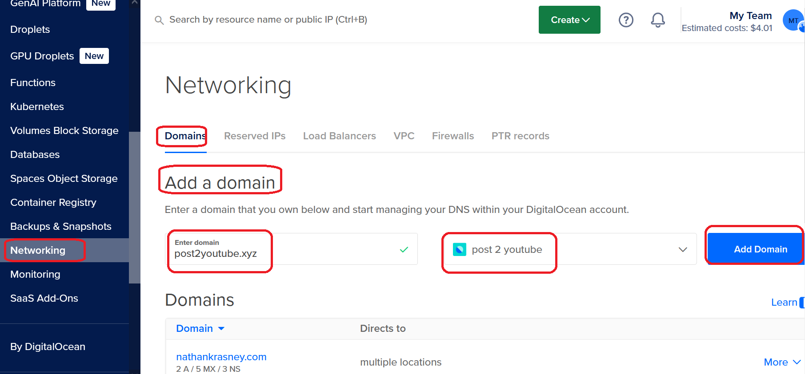
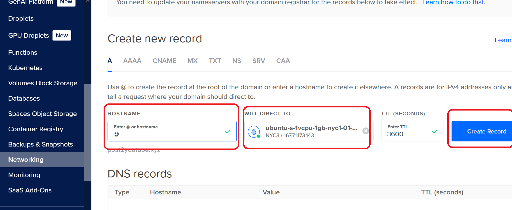
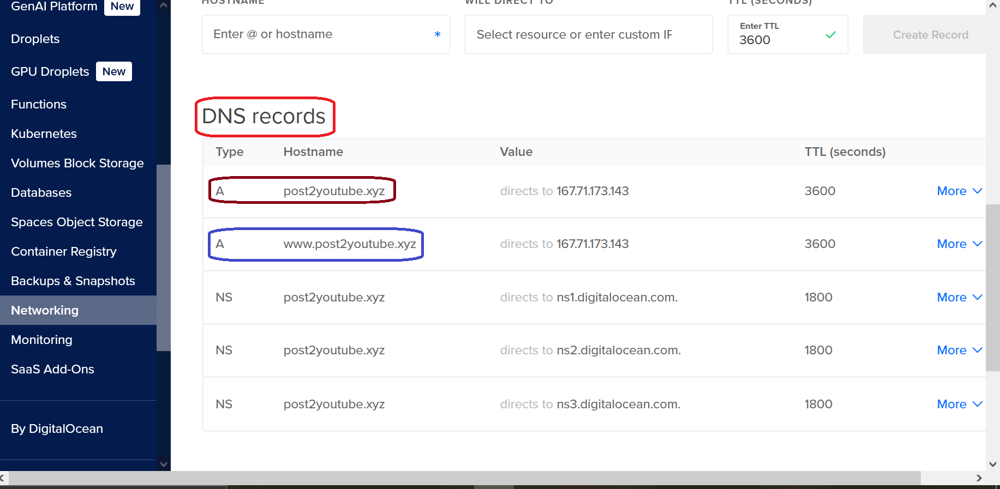
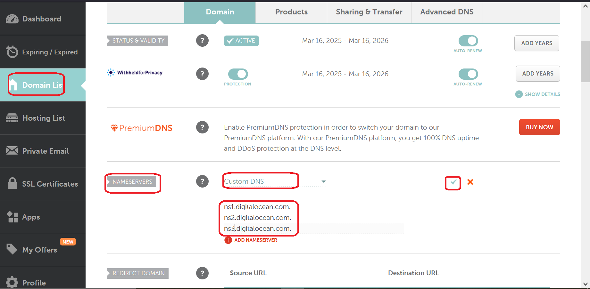
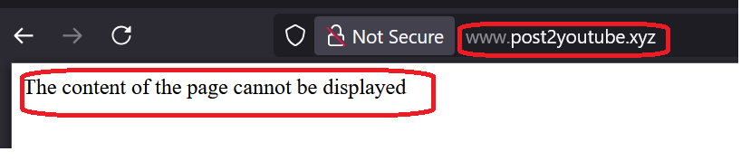
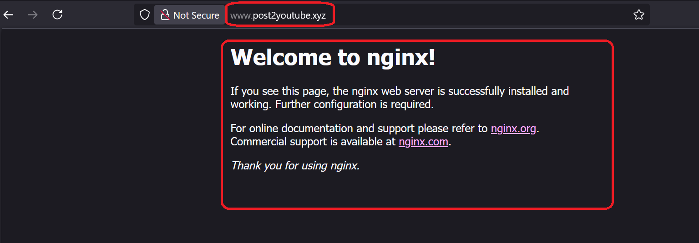
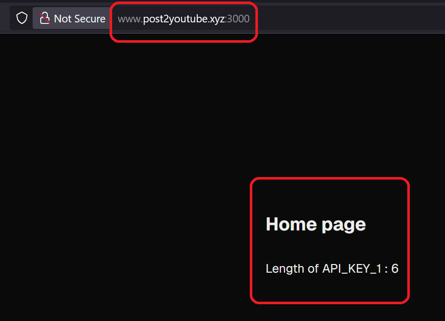

<h1>Project Name</h1>
Setup digital ocean droplet for next.js application


<h2>Project Description</h2>
This project represent the setup that you need to perform once before you want to use next.js app on digital ocean droplet

<h2>Motivation</h2>
You have a next.js application and you want to host it on digital ocean droplet - VPS. You want to use https and a domain. What setup is required on the droplt to achive this ?

<h2>Installation</h2>
Execute the following steps in sequence for a one-per-droplet configuration.


<h3>Install node and npm</h3>
    <ol>
        <li><strong>Update your package index:</strong>
            <pre><code>sudo apt update</code></pre>
        </li>
        <li><strong>Install Node.js and npm:</strong>
            <pre><code>sudo apt install nodejs npm</code></pre>
        </li>
        <li><strong>Verify the installation:</strong>
            <ul>
                <li>Check the Node.js version:
                    <pre><code>node -v</code></pre>
                </li>
                <li>Check the npm version:
                    <pre><code>npm -v</code></pre>
                </li>
            </ul>
        </li>
    </ol>


<h3>Make pm2 global (one point of truth)</h3>

1. <strong>Install pm2 Globally as Root</strong>

Install pm2 globally:

```bash
sudo npm install -g pm2
```

Verify installation:

```bash
pm2 -v
```

2. <strong>Ensure Non-Root User Can Access pm2</strong>
Log in as the Non-Root User:

If you're currently logged in as root, switch to the non-root user:

```bash
su - <non-root-username>
```

Add /usr/local/bin (or wherever global npm binaries are installed , verify with 'npm config get prefix') to the non-root user's PATH:

```bash
echo 'export PATH=/usr/local/bin:$PATH' >> ~/.bashrc
source ~/.bashrc # reload changes immediately
```

Confirm the non-root user can invoke pm2:

```bash
su - <non-root-username>
pm2 -v
```

3. <strong>Grant Write Access to PM2 Files</strong>
Change ownership of pm2 directories to the non-root user:

```bash
sudo chown -R <non-root-username>:<non-root-username> /home/<non-root-username>/.pm2
```

Verify that the .pm2 directory for the user exists:

```bash
ls -l /home/<non-root-username>/.pm2
```

4. <strong>Test PM2 Commands as Non-Root User</strong>

```bash
su - <non-root-username>
```

Start an application (e.g., app.js):

```bash
pm2 start app.js --name "my-app"
pm2 list
```
You can also use shell command e.g. ls instead of app.js

5. <strong>Configure CI/CD Pipeline to Use Non-Root User</strong>

Update your CI/CD pipeline's ssh commands to switch to the non-root user. For example:

```bash
ssh non-root-user@VPS_IP "pm2 restart my-app"
```

6. <strong>Set Up Autostart for PM2 (Optional for Production)</strong> 
need to be invoked once
While logged in as the non-root user, configure autostart for the system:

```bash
pm2 startup
```

Follow the generated instructions, which may include running a sudo command to finalize the setup.


Once done you can check the status as follows
```bash
sudo systemctl status pm2-<non-root-username>
```


7. <strong>Save PM2 Processes (Optional)</strong>
Save the current list of processes so they can be restored after a reboot:

```bash
pm2 save
```

<h3>Install Nginx</h3>


<ol>
  <li><code>sudo apt update</code> - Update your package index</li>
  <li><code>sudo apt install nginx</code> - Install Nginx</li>
  <li><code>sudo ufw allow 'Nginx Full'</code> - Open both ports 80 (HTTP) and 443 (HTTPS)</li>
  <li><code>sudo systemctl start nginx</code> - Start Nginx</li>
  <li><code>sudo systemctl enable nginx</code> - Enable Nginx to start on boot</li>
  <li><code>sudo systemctl status nginx</code> - Verify Installation</li>
</ol>

The configuration for this default behavior is usually stored in the /etc/nginx/sites-available/default file, and it’s symlinked to /etc/nginx/sites-enabled/default. This file appears in this repo : ./config/nginx/default

<h3>Configure Nginx</h3>
<ol>
  <li>
    <strong>Create the file in your GitHub repository:</strong> Store the <code>my-app.conf</code> file in your project's <code>config/nginx</code> directory.
    <pre>
      <code>
server {
    listen 80;

    location / {
        proxy_pass http://localhost:3000; # Adjust port if needed
        proxy_http_version 1.1;
        proxy_set_header Upgrade $http_upgrade;
        proxy_set_header Connection 'upgrade';
        proxy_set_header Host $host;
        proxy_cache_bypass $http_upgrade;
    }
}
      </code>
    </pre>
  </li>
  <li>
    <strong>Move and link the file</strong> In your GitHub Actions workflow, after the code is checked out,  execute the following commands on your DigitalOcean droplet:
    <pre>
      <code>
sudo mv ./config/nginx/my-app.conf /etc/nginx/sites-available/my-app.conf
sudo ln -sf /etc/nginx/sites-available/my-app.conf /etc/nginx/sites-enabled/my-app.conf
      </code>
    </pre>
    <p>Note: <code>./config/nginx/my-app.conf</code> refers to the file in the <code>config/nginx</code> directory of your cloned repository.</p>
  </li>
  <li>
    <strong>Reload Nginx:</strong> Immediately after the move and link commands, reload the Nginx configuration:
    <pre>
      <code>
sudo systemctl reload nginx
      </code>
    </pre>
  </li>
</ol>

using this file you can now access the next.js app via the browser using the droplet ip and port 3000

<h3>Setup domain in digital ocean droplet</h3>
We now can access the application using the droplet port but in general you want to use it via a domain so here i show it using namecheap
<ol>
<li>Purchase a domain e.g. from namecheap</li>
<li>Add the domain to digital ocean  :navigate to mangae->networking->domains.
Enter domain - posttoyoutube.xyx, choose project - 'post 2 youtube' and click 'Add domain' 

</li>
<li>Create new record :
HOSTNAME : @
'WILL DIRECT TO' : add here your doplet
click on the button create record

as shown in the following image


create also record for hostname www with the same 'WILL DIRECT TO'

the resulted created records appear in the follwoing image where the @ record appears in brown and www record appears in blue 

</li>
</ol>

<h3>Setup domain in namecheap</h3>
Here we will tell the domain provider - namecheap about digital ocean.
from the dashboard choose the domain post2youtube.xyz and click Manage.
scroll down and for NAMESERVERS choose "custom DNS' and enter what was written in digitl ocean (prev image): ns1.digitalocean.com. ns2.digitalocean.com. ns3.digitalocean.com. as follows



This might take some time to take effect

if you try to access it immidiately you might not be able to see the page




But after few minutes you will get the default nginx page but with the correct domain post2youtube.xyz 



you can access the next.js app using the domain but still need the 3000 port 




<h3>Access next.js app without port</h3>

update server_name in my-app.conf 

```config
server {
listen 80;
server_name post2youtube.xyz www.post2youtube.xyz;
}
```

as than

  ```bash
  sudo nginx -t # test configuration
  sudo systemctl reload nginx # reload Nginx to apply changes:
  ```
It is not working because the default nginx file - /etc/nginx/sites-enabled/default get in the way so i reomve the symbolic link 

```bash
sudo rm /etc/nginx/sites-enabled/default
```

but it still exist in /etc/nginx/sites-available/ (yet not active because link removed from sites-enabled)

after this

```bash
sudo nginx -t  # Test the configuration for syntax errors
sudo systemctl reload nginx
```

now access http://post2youtube.xyz will access the next.js app without need for the port but still the connection is not secured because http is used - not https

<h3>Use https and certificate</h3>
<p>Now i want to access next.js app without 'Not Secure'</p>
    <strong>1. Install Certbot</strong>
    <ul>
        <li>Update the package list:
            <pre><code>sudo apt update</code></pre>
        </li>
        <li>Install Certbot and the Nginx plugin:
            <pre><code>sudo apt install certbot python3-certbot-nginx</code></pre>
        </li>
    </ul>

  <strong>2. Obtain an SSL Certificate</strong>
    <ul>
        <li>Run Certbot to get a certificate and configure Nginx:
            <pre><code>sudo certbot --nginx -d post2youtube.xyz -d www.post2youtube.xyz</code></pre>
        </li>
        <li>Certbot will automatically configure SSL and set up redirection.</li>
    </ul>

  <strong>3. Verify Certificate Renewal</strong>
    <ul>
        <li>Test automatic renewal:
            <pre><code>sudo certbot renew --dry-run</code></pre>
        </li>
    </ul>

  <strong>4. Review Nginx Configuration</strong>
    <p>The Nginx configuration file will look like this:</p>
    <pre><code>
server {
    listen 80;
    server_name post2youtube.xyz www.post2youtube.xyz;
    return 301 https://$host$request_uri;
}

server {
    listen 443 ssl;
    server_name post2youtube.xyz www.post2youtube.xyz;

    ssl_certificate /etc/letsencrypt/live/post2youtube.xyz/fullchain.pem;
    ssl_certificate_key /etc/letsencrypt/live/post2youtube.xyz/privkey.pem;
    ssl_protocols TLSv1.2 TLSv1.3;
    ssl_ciphers HIGH:!aNULL:!MD5;

    location / {
        proxy_pass http://localhost:3000;
        proxy_http_version 1.1;
        proxy_set_header Upgrade $http_upgrade;
        proxy_set_header Connection 'upgrade';
        proxy_set_header Host $host;
        proxy_cache_bypass $http_upgrade;
    }
}
    </code></pre>

  <strong>5. Restart Nginx</strong>
    <ul>
        <li>Test and reload Nginx:
            <pre><code>
sudo nginx -t
sudo systemctl reload nginx
            </code></pre>
        </li>
    </ul>

  <strong>6. Verify HTTPS</strong>
    <ul>
        <li>Visit: <a href="https://post2youtube.xyz" target="_blank">https://post2youtube.xyz</a></li>
        <li>Ensure your site is accessible over HTTPS.</li>
    </ul>


<h2>Technologies Used</h2>
<ul>
<li>digital ocean droplet</li>
<li>nginx (1.26.0)</li>
<li>ubuntu (24.10)</li>
<li>node (v20.16.0)</li>
<li>pm2 (5.4.3)</li>
<li>https</li>
<li>namecheap</li>
<li>next.js (15.2.1)</li>
</ul>


<h2>Points of Interest</h2>
<ul>
    <li>Altough the subject of this repo is 'Setup digital ocean droplet for next.js application' it can be used for deploying any node based web site</li>
</ul>

<h2>Refrences</h2>
<ul>
    <li id='ref1'>The next.js application appears in the following <a href='https://github.com/NathanKr/simple-ci-cd-pipeline-for-next.js-app'>repo</a> including CI\CD workflow</li>
</ul>


